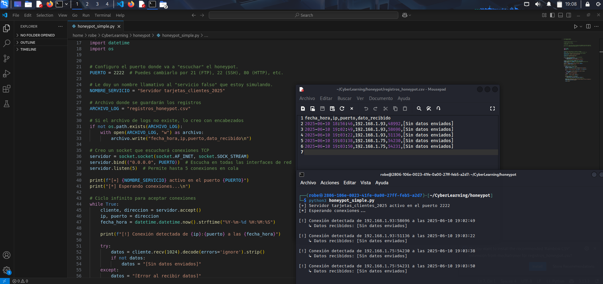
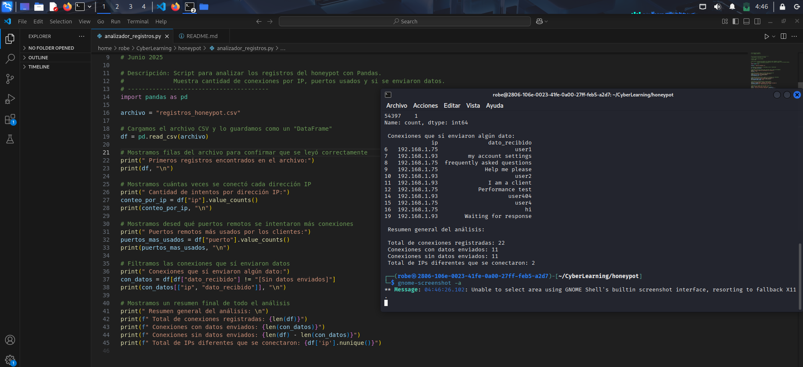

# Simple Honeypot in Python and Connection Analyzer

This project contains a simple honeypot that simulates a fake server and logs connection attempts, as well as a Python script that analyzes those logs to extract useful information.

## What this project does

### simple_honeypot.py

- Listens for incoming connections on port 2222.
- Simulates a fake server named tarjetas_clientes_2025.
- Records the following information:
  - Visitor IP address
  - Remote port
  - Date and time
  - Data sent by the client
- Saves everything into the honeypot-logs.csv file.

### honeypot-log-analysis.py

- Reads the log file in CSV format.
- Displays:
  - Total number of recorded connections 
  - Connections where data was received 
  - Number of attempts per IP address 
  - Remote ports used by the clients 

## How to run

### 1. Run the honeypot

Command:
python3 simple-honeypot.py

From another terminal or a device on the same network, connect using:
nc 2222
Example:
nc 192.168.1.93 2222

### 2. Run the analyzer

Command:
python3 honeypot-log-analysis.py

## Example output (honeypot)

## Example content of honeypot_logs.csv

## Example output (analyzer)

## What I learned

- Creating TCP servers using sockets.
- Structured logging of connections in CSV format.
- Event analysis using Python and pandas.
- First steps in monitoring network activity.

---
Javier Avila
