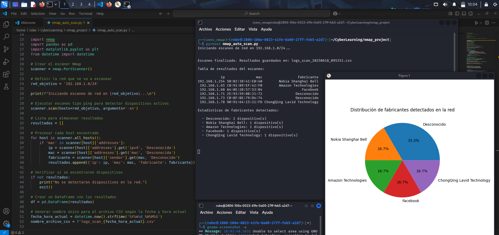

# Nmap Automated Scan – Python

This project contains a Python script that performs an automated network scan using Nmap and generates useful statistics about active devices. It combines active scanning, CSV logging, and basic data visualization.

## What this project does

- Runs an Nmap scan using the command: nmap -sn
- Detects active devices on the local network
- Collects information such as IP address, MAC address, and vendor (when available)
- Saves the scan results automatically into a CSV file with a unique timestamp in its name
- Displays in the terminal:
  - A clean table of detected devices
  - Text-based statistics grouped by vendor
- Generates a pie chart showing the vendor distribution

## Generated files

- logs_scan_20250618_095351.csv
  CSV file containing the results of the scan
- A pie chart shown at the end of the script execution (not saved by default)

## How to run

1. Activate the virtual environment
   source venv_nmap/bin/activate

2. Run the script
   python3 nmap-auto-scan.py

The script will display the scan results in the terminal and show a pie chart when the scan is complete.

## Technologies used

- Python 3.13
- Nmap
- pandas
- matplotlib

## Author

Javier Avila
