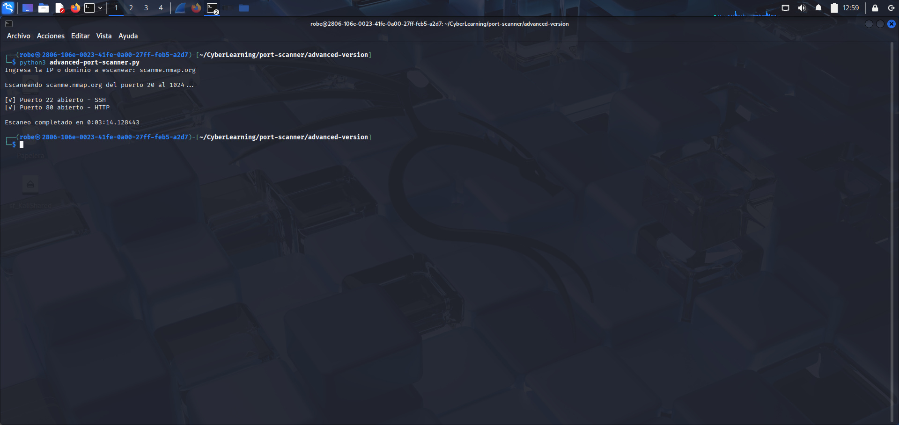

# Advanced Port Scanner – Python

This project contains an improved version of the basic port scanner. In addition to detecting open ports on a target host, it also identifies the service commonly associated with each port (such as HTTP, SSH, FTP, and others).

## Purpose

Knowing which ports and services are exposed on a server or device is essential in cybersecurity. This script helps:

- Detect open ports  
- Identify the service running behind each port  
- Practice basic scanning using pure Python, without external tools like Nmap  

## How it works

1. Run the script named advanced-port-scanner.py  
2. Enter an IP address or domain when prompted (for example: scanme.nmap.org or a local IP)  
3. The script scans ports from 20 to 1024 and prints the ones that respond as open, along with their corresponding service names  

## What I learned

- How to detect open ports using Python sockets  
- How to identify the service associated with a port using getservbyport  
- The importance of using a timeout to avoid delays during scanning  
- How to structure a more complete script with controlled errors and clear messages  
- Additional practice in networking, scanning, and simple automation tasks related to cybersecurity  

## Author

Javier Ávila
