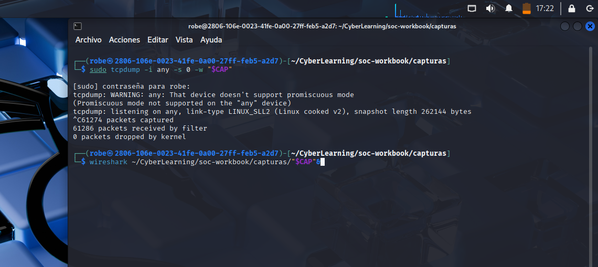
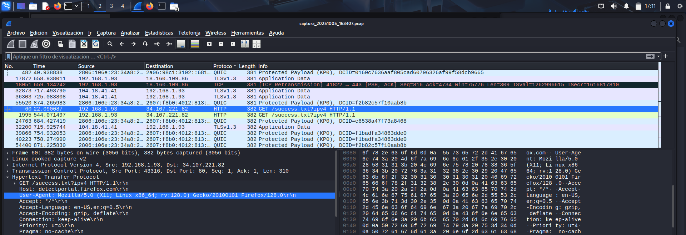
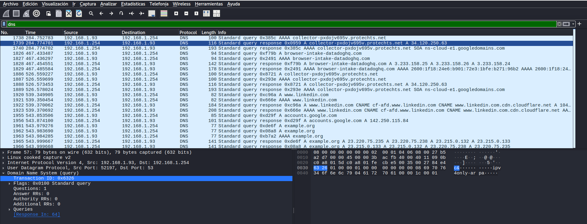
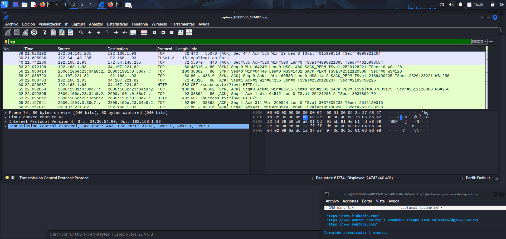
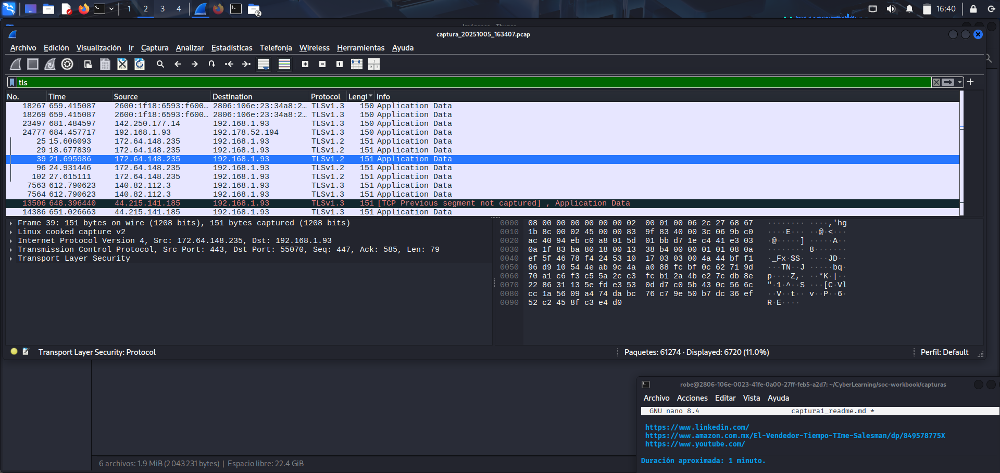
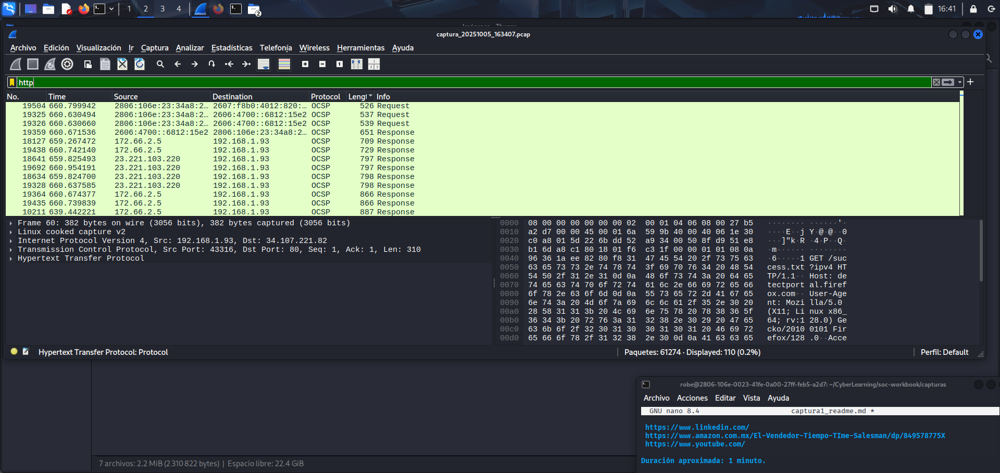

# Network Traffic Capture and Analysis – tcpdump and Wireshark

Date: October 5, 2025  
File: capture_20251005_163407.pcap  
Tools used: tcpdump, Wireshark  
System: Kali Linux

## Objective

Capture real network traffic from my machine while browsing common websites and analyze the main protocols involved (DNS, TCP, TLS, and HTTP).  
The goal is to understand how communication flows across the network and the role of each protocol in the process.

## Procedure

1. Opened a terminal in Kali Linux and started the capture using:  
   sudo tcpdump -i any -s 0 -w capture_20251005_163407.pcap

   This captured all traffic from any network interface.

2. Browsed several websites for about one minute (LinkedIn, Amazon, YouTube).

3. Stopped the capture with Ctrl+C.  
   The terminal reported more than 61,000 packets captured with no packet loss.

4. Opened the file in Wireshark using:  
   wireshark capture_20251005_163407.pcap

5. Applied filters in Wireshark to inspect specific types of traffic:  
   dns  
   tcp  
   tls  
   http

## Protocol analysis

### DNS

Observed several DNS queries from my machine (192.168.1.93) to the router's DNS server (192.168.1.254).  
Domains queried included:  
- example.org  
- accounts.google.com  
- www.linkedin.com  
- collector-pxdojv695v.protechts.net

All DNS queries received valid responses.

### TCP

Identified TCP handshakes between my machine and external servers on ports 80 (HTTP) and 443 (HTTPS).  
The SYN → SYN/ACK → ACK sequence was clearly visible.  
No retransmissions or connection failures were detected.

### TLS

After the TCP handshake, several TLSv1.3 packets were observed.  
Connections included servers such as:  
- 172.64.148.235 (Mozilla/Cloudflare)  
- 44.215.141.185 (Amazon Web Services)

Client Hello packets confirmed the start of encrypted HTTPS communication.

### HTTP

Using the http filter, found unencrypted HTTP requests on port 80.  
One example:  
GET /success.txt?ipv4 HTTP/1.1  
Host: detectportal.firefox.com  

This request is used by Firefox to verify Internet connectivity.  
HTTP traffic appeared in plain text, confirming the absence of encryption.

## Conclusion

This analysis helped me understand how multiple protocols interact during normal web browsing.  
Key observations:

- DNS resolves domain names  
- TCP establishes the initial connection  
- TLS provides encryption for secure communication  
- HTTP shows clear-text requests when no encryption is used  

The capture and analysis process showed how each protocol contributes to network communication and how their behavior can indicate normal or unusual activity.

---

Javier Avila
