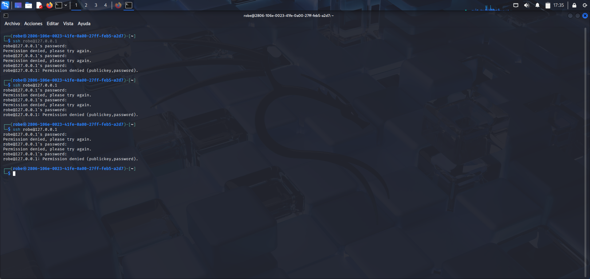
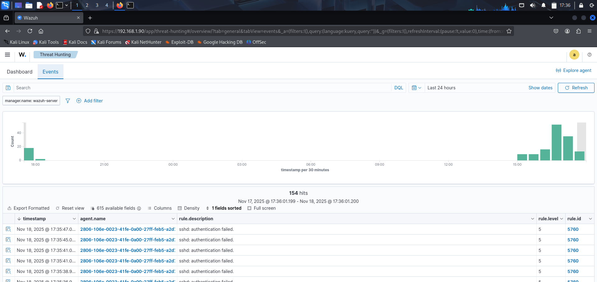
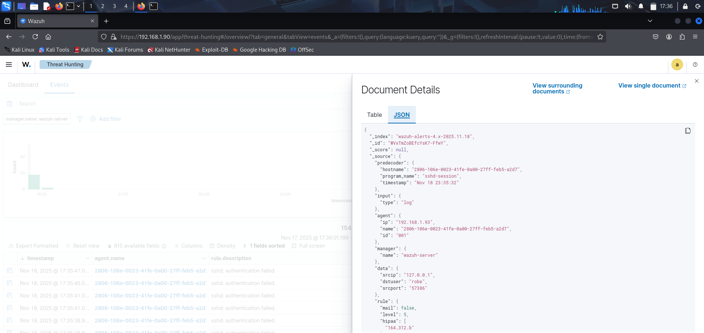
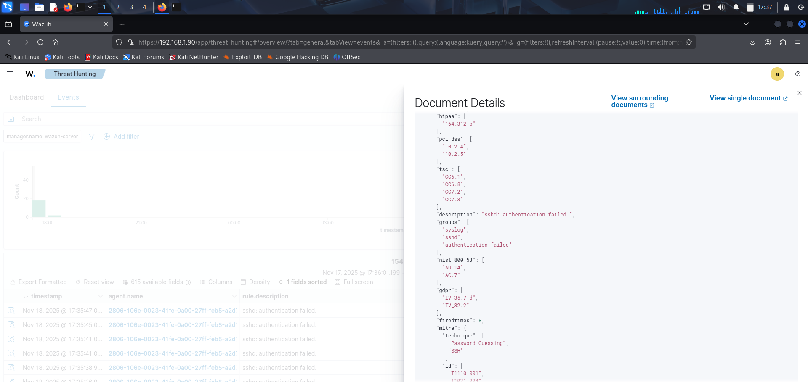

## SSH Authentication Failures (Brute-Force Simulation)

### Objective:
To simulate several failed SSH login attempts and verify how Wazuh detects this type of authentication activity.

### Procedure:
1. I attempted to connect to my own device with the following command:

- **ssh robe@127.0.0.1**

2. I intentionally entered the wrong password multiple times.

**The terminal displayed:**

*Permission denied, please try again.*
*Permission denied (publickey,password).*

### Results in Wazuh:
Wazuh detected and logged the failed attempts with the following details:

- Description: sshd: authentication failed
- Rule ID: 5760 
- Rule Level: 5
- User: robe
- Source IP: 127.0.0.1
- Program: sshd-session

**Example from full_log**

*Failed password for robe from 127.0.0.1 port 57386 ssh2*

### MITRE ATT&CK Mapping:
T1110.001 — Password Guessing
T1021.004 — SSH

### Analysis:
Wazuh correctly detected the repeated SSH authentication failures and classified them as suspicious activity.
The log was processed using rule 5760, which identifies failed SSH login attempts.

### Conclusion:
Wazuh successfully detected and documented the SSH authentication failures, confirming its effectiveness in monitoring brute-force behavior.

