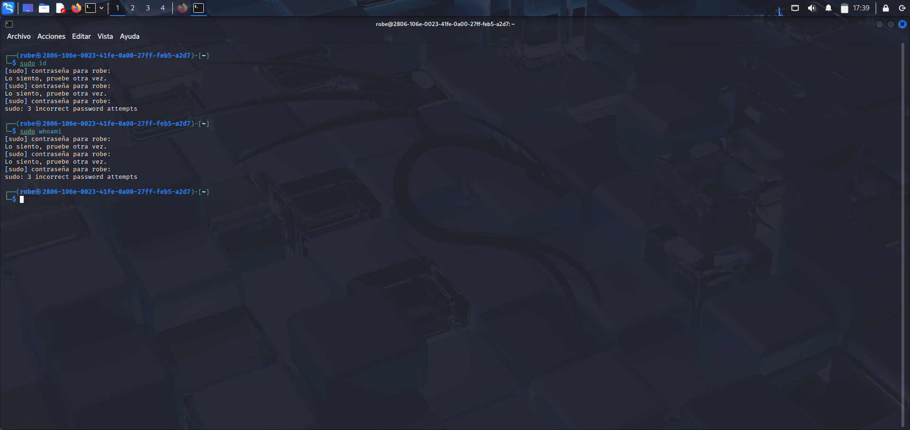
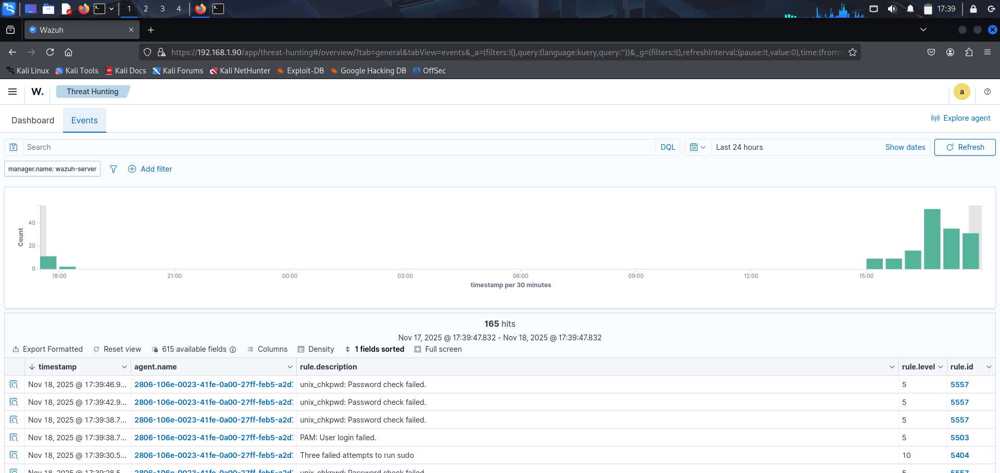
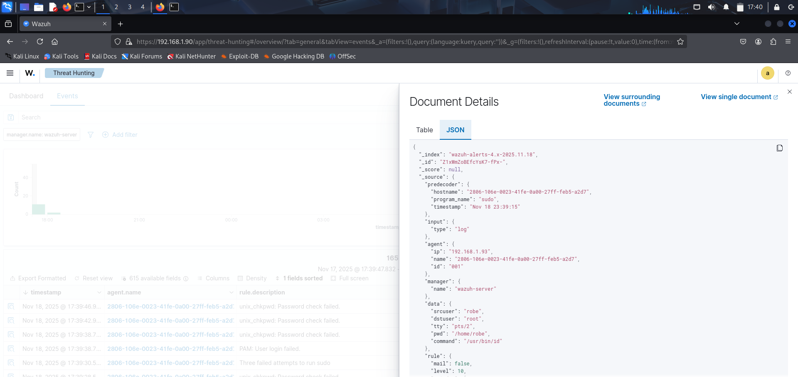
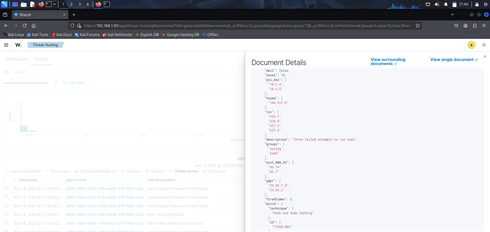

## Sudo Authentication Failures

### Objective:
To test how Wazuh detects incorrect sudo password attempts on a Linux endpoint.

### Procedure:
1. I used sudo commands while intentionally entering an incorrect password.

Commands executed:
'
sudo id
sudo whoami
'

2. After three failed attempts, the terminal showed:
'
sudo: 3 incorrect password attempts
'

### Results in Wazuh:
Wazuh generated alerts for these events:

'
Description: Three failed attempts to run sudo
Main Rule ID: 5503
Other Related Rules: 5557, 5404
Rule Level: 10
Program: sudo
User: robe
'

**Example from full_log:**
'
robe : 3 incorrect password attempts ; TTY=pts/2 ; PWD=/home/robe ; USER=root ; COMMAND=/usr/bin/id
'

### MITRE ATT&CK Mapping:
'
T1548.003 — Abuse Elevation Control Mechanisms (Sudo and Sudo Caching)
'

### Analysis:
Wazuh identified the incorrect sudo authentication attempts and classified them as high-risk events. 
Rules related to password verification failures and privilege escalation were triggered.

### Conclusion:
The sudo authentication failures were detected correctly, and Wazuh handled the event with the appropriate rule severity.

