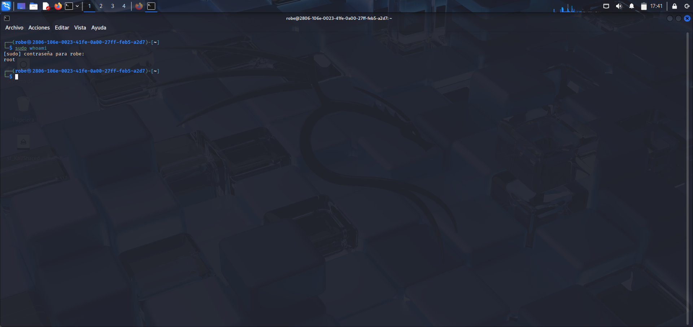
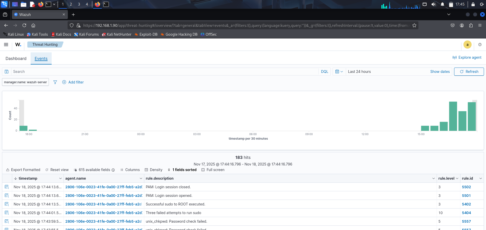
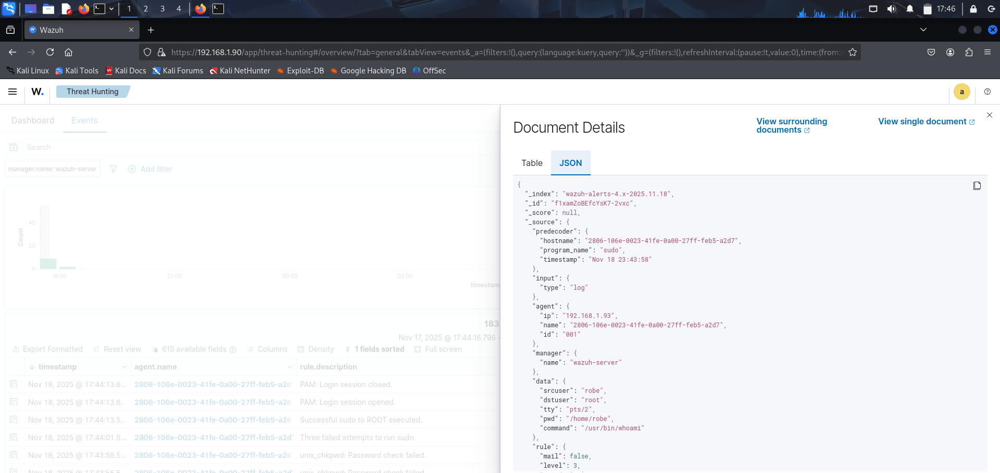
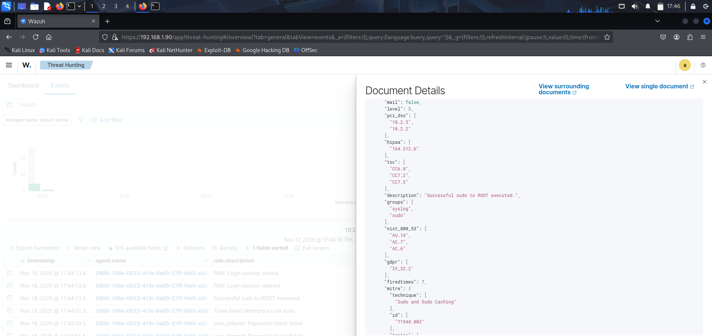

## Successful Sudo Privilege Escalation

### Objective:
To confirm how Wazuh detects successful privilege escalation using sudo.

### Procedure:

1. I executed:

- **sudo whoami**

2. This time I entered the correct password. 

The terminal returned:

*root*

### Results in Wazuh:
Wazuh generated a detection event for the successful sudo execution:

- Description: Successful sudo to ROOT executed
- Rule ID: 5402
- Rule Level: 3
- User: robe
- Target User: root
- Command: /usr/bin/whoami

**Example from full_log:**
*robe : TTY=pts/2 ; PWD=/home/robe ; USER=root ; COMMAND=/usr/bin/whoami*

### MITRE ATT&CK Mapping:

T1548.003 — Privilege Escalation

### Analysis:
Wazuh accurately recorded the privilege escalation event. 
The logs reflected a normal, successful use of sudo, and Wazuh classified it with a lower severity level because no malicious behavior was detected.

### Conclusion:
Wazuh successfully detected the sudo privilege escalation, showing that it can differentiate between failed and successful authentication attempts and register both for audit purposes.
