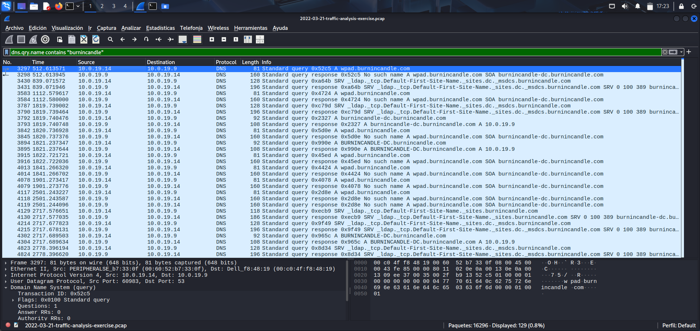
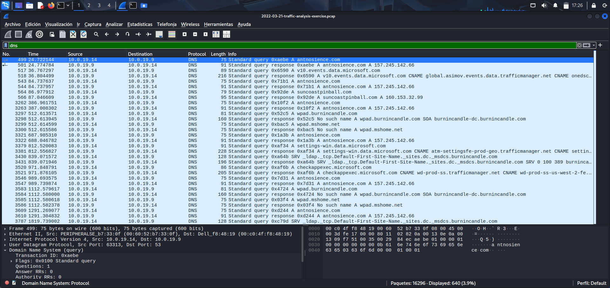
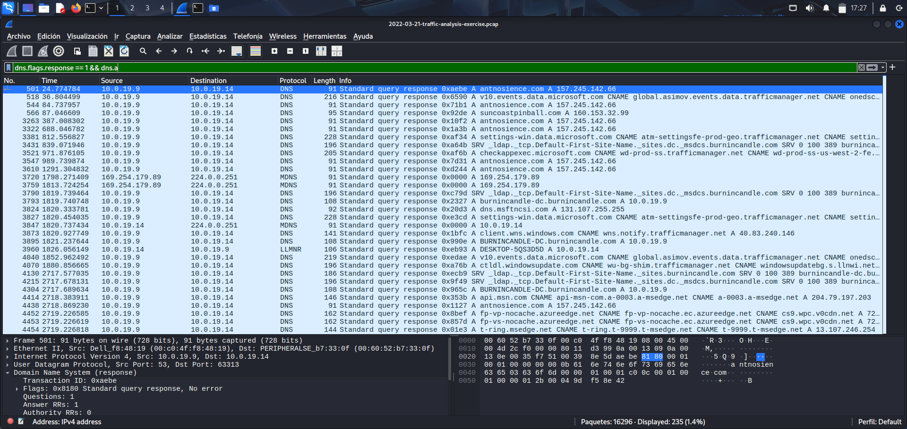
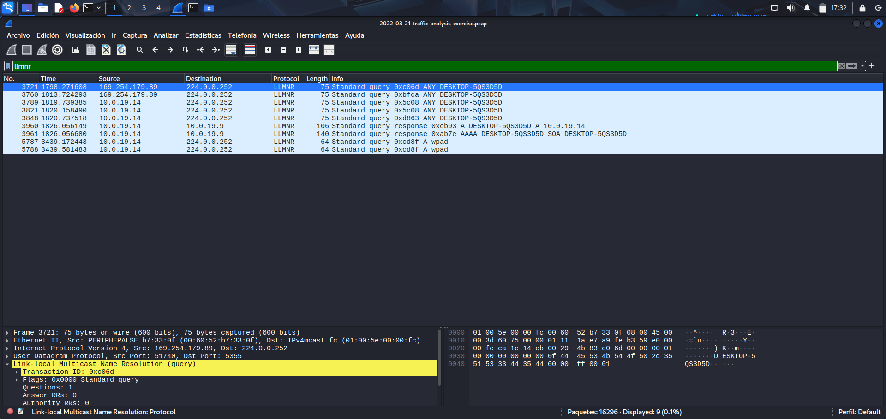
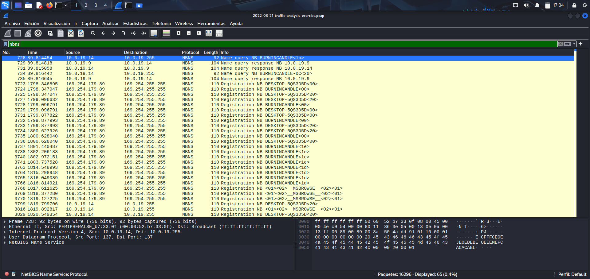
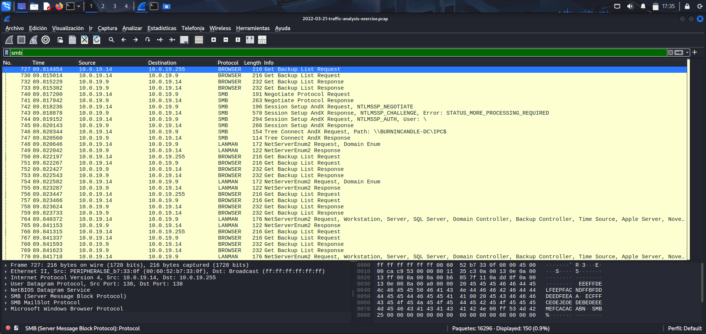
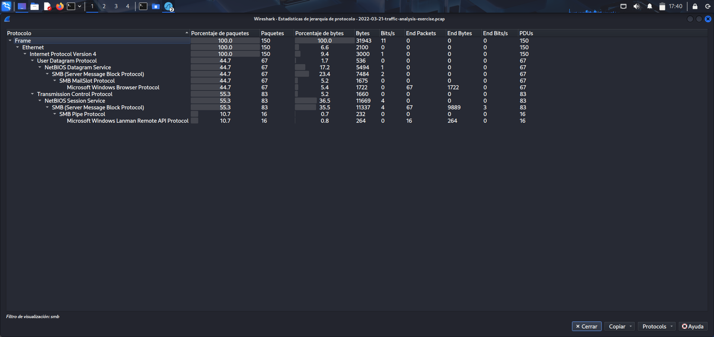

# PCAP Analysis – DNS Anomalies and Internal Reconnaissance  
---

## 1. Overview

In this project, I analyzed a network capture file to identify suspicious activity inside a Windows domain environment.  
The analysis focuses on DNS anomalies, internal name resolution, and communication with an internal host (10.0.19.9).  

All evidence images are stored in the **/evidence** folder.

## 2. Objectives

- Detect unusual DNS activity  
- Identify suspicious domains and subdomains  
- Pivot from DNS responses to the related internal host  
- Analyze LLMNR and NBNS traffic  
- Investigate SMB, LDAP, and DCERPC communication  
- Document findings in a clear and professional format  

## 3. Methodology

I used Wireshark to apply different filters and review the traffic in specific stages:

1. DNS queries and subdomains  
2. DNS responses resolving to an internal IP  
3. Full communication with the internal host  
4. LLMNR and NBNS activity for internal reconnaissance  
5. SMB, LDAP, and DCERPC traffic  
6. Protocol hierarchy to understand traffic distribution  

## 4. Findings

### **Finding 1 – High-volume DNS traffic to suspicious domain**

I observed a large number of DNS queries to **burnincandle.com** and multiple subdomains.  
This amount of DNS traffic is not normal for a workstation and may indicate automated communication or malware activity.

**Evidence:**  

### **Finding 2 – Multiple suspicious subdomains (possible DGA behavior)**

The DNS traffic included strange and repetitive subdomains such as:

- `pad.burnincandle.com`  
- `burnincandle-dc.burnincandle.com`  
- other unusual names  

These subdomains look automated and may be generated by a domain generation algorithm (DGA).

**Evidence:**  

### **Finding 3 – DNS response resolving to internal IP (10.0.19.9)**

Instead of resolving to an external address, the suspicious domain returned the internal IP **10.0.19.9**.  
This behavior is unexpected and may indicate internal redirection or sandbox behavior.

**Evidence:**  

### **Finding 4 – Internal reconnaissance using LLMNR and NBNS**

The PCAP shows active LLMNR and NBNS traffic.  
These protocols are often used for internal host discovery and can be abused by attackers.

**Evidence:**  
  

### **Finding 5 – SMB, LDAP, and DCERPC communication with internal host**

After resolving the suspicious domain to 10.0.19.9, the workstation started communicating with the same host using:

- **SMB2**  
- **LDAP**  
- **DCERPC**

This traffic is commonly used for authentication, resource access, and domain enumeration.  
This behavior matches post-exploitation techniques inside a Windows environment.

**Evidence:**  

## 5. Protocol Hierarchy Summary

To understand the overall distribution of traffic, I used the Protocol Hierarchy view.  
It shows how much of the capture is DNS, SMB, NBNS, LLMNR, TCP, and UDP.

**Evidence:**  

## 6. Conclusion

This PCAP contains clear indicators of suspicious activity:

- DNS anomalies  
- Possible domain generation behavior  
- Internal name resolution traffic  
- Communication with a single internal host using domain controller protocols  

If this traffic happened in a real environment, I would recommend:

- Blocking the suspicious domain  
- Investigating the host 10.0.19.9  
- Reviewing authentication logs  
- Checking for lateral movement  
- Running an endpoint investigation on the affected workstation  

---

## 7. Author

**Javier Ávila**  
**NOV-2025**
