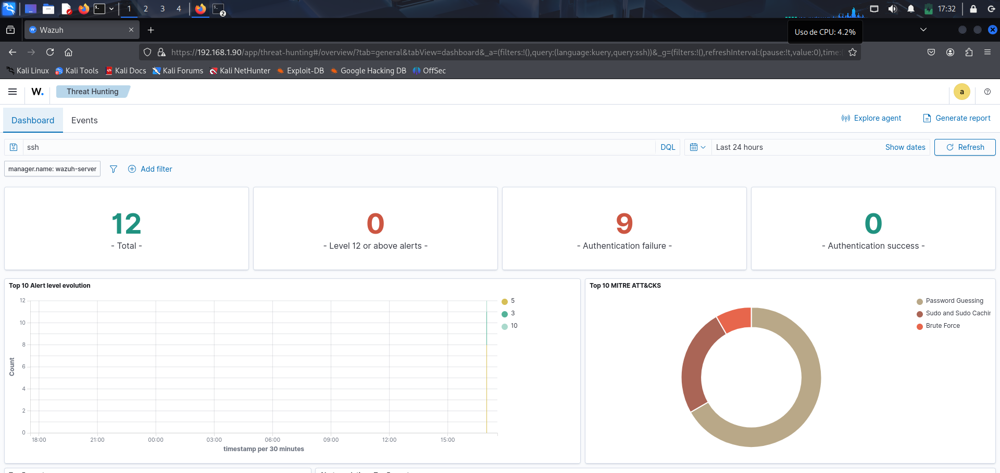
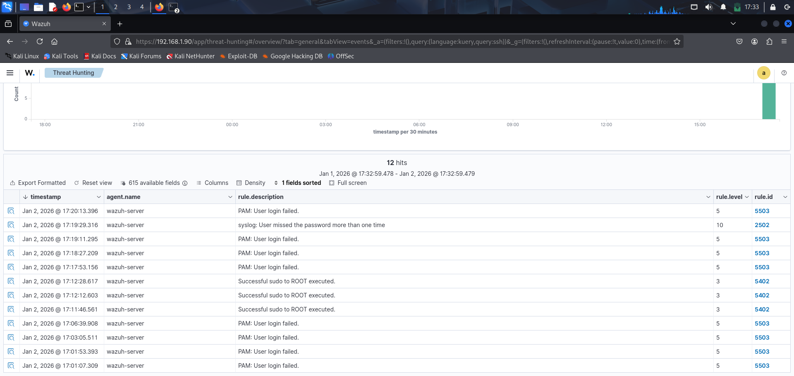
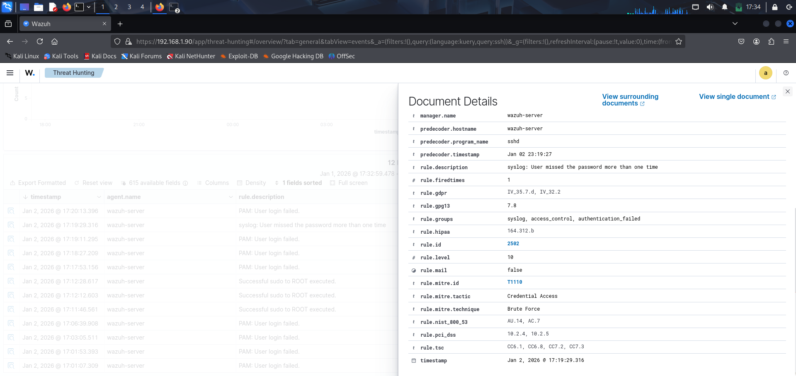
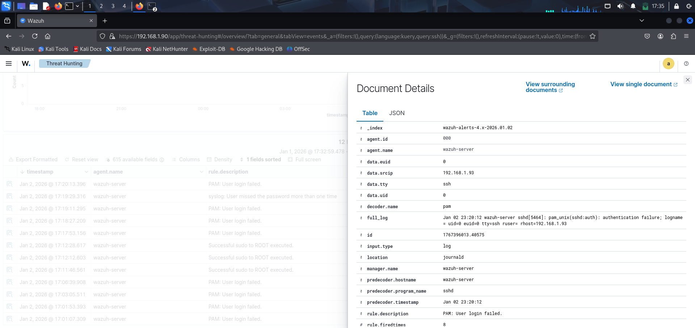
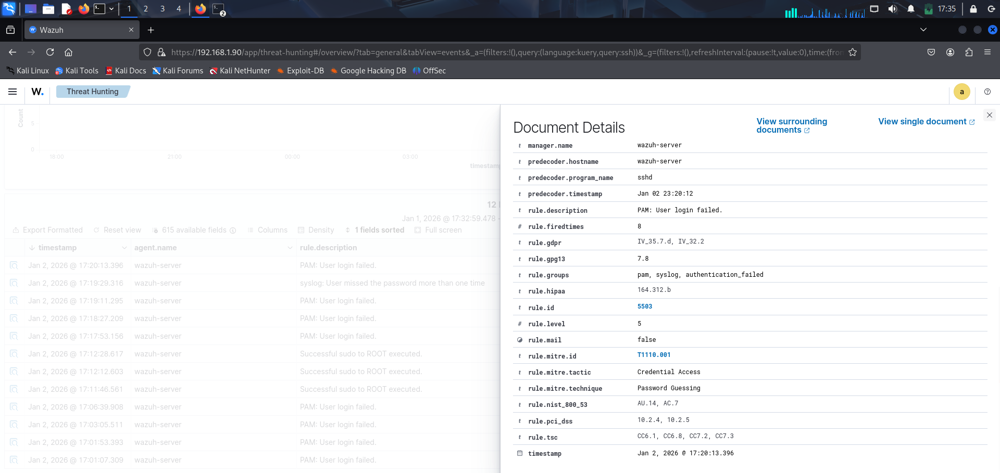

# SSH Brute Force Detection – Wazuh SIEM

## Scenario Overview

This scenario documents the detection and analysis of multiple **failed SSH authentication attempts** against a monitored Linux system using **Wazuh SIEM**.

The activity observed is consistent with **password guessing / brute force behavior**, identified through repeated authentication failures within a short time frame.

The objective of this scenario is to demonstrate **SOC Analyst skills** in detection, investigation, and interpretation of security alerts related to SSH access.

---

## Environment

- **SIEM:** Wazuh 4.14.0 OVA  
- **Monitored service:** SSH (`sshd`)  
- **Agent:** wazuh-server  
- **Log source:** journald / sshd  
- **Time range analyzed:** Last 24 hours  

---

## Initial Detection – Threat Hunting Dashboard

The first indicator of suspicious activity was identified in the **Threat Hunting Dashboard** after applying the `ssh` filter.

### Observations:
- **12 total SSH-related alerts**
- **9 authentication failures**
- **0 successful authentications**
- Detected techniques aligned with:
  - Password Guessing
  - Brute Force

This behavior suggests repeated unauthorized access attempts.

---

## Event Review – SSH Alerts Table

A detailed review of SSH-related events confirms multiple failed authentication attempts followed by privileged activity.

### Relevant event types:
- `PAM: User login failed`
- `User missed the password more than one time`
- `Successful sudo to ROOT executed`

The sequence indicates authentication failures prior to successful privilege escalation.

---

## Event Analysis – Multiple Password Failures

One of the most relevant alerts corresponds to repeated password failures detected by Wazuh.

### Technical details:
- **Rule ID:** 2502  
- **Rule level:** 10  
- **Rule description:** User missed the password more than one time  
- **MITRE ATT&CK ID:** T1110  
- **Tactic:** Credential Access  
- **Technique:** Brute Force  

This alert confirms multiple failed login attempts from the same source.

---

## Event Analysis – PAM Authentication Failure

Additional alerts show repeated PAM authentication failures related to SSH access.

### Technical details:
- **Rule ID:** 5503  
- **Rule level:** 5  
- **Rule description:** PAM: User login failed  
- **MITRE ATT&CK ID:** T1110.001  
- **Technique:** Password Guessing  

These events reinforce the presence of repeated unauthorized login attempts.

---

## MITRE ATT&CK Mapping

| Tactic              | Technique           | ID        |
|---------------------|---------------------|-----------|
| Credential Access   | Brute Force         | T1110     |
| Credential Access   | Password Guessing   | T1110.001 |

---

## Conclusion

The analyzed alerts show clear evidence of **repeated SSH authentication failures**, consistent with a **brute force or password guessing attempt**.

Wazuh successfully detected, classified, and correlated these events, allowing timely visibility into potential unauthorized access attempts.  
This scenario demonstrates effective **threat detection and investigation workflows** expected from a **SOC Analyst**.

---

## Evidence

All supporting screenshots and visual evidence are stored in the `evidence/` directory and referenced throughout this document.
