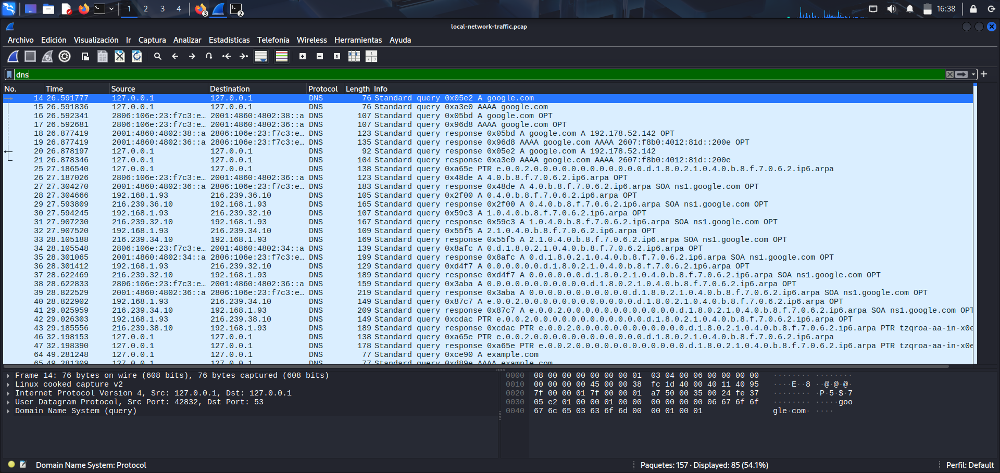
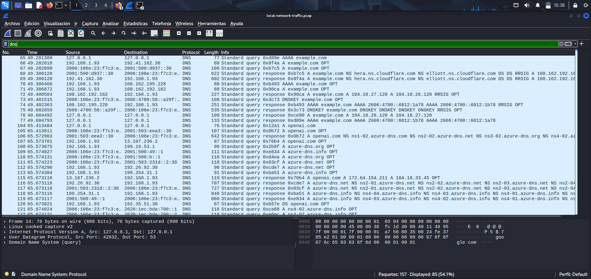

# Network Traffic Analysis (PCAP Review)

## Objective
Analyze **captured network traffic** using a PCAP file and determine whether the observed activity represents **normal network behavior** or **potential security issues**.

The analysis focuses on **DNS, ICMP, HTTP, and TCP traffic**, using **Wireshark display filters**.

## Environment
- **Tool:** Wireshark  
- **File analyzed:** local-network-traffic.pcap  
- **Analysis type:** Offline PCAP analysis  

## DNS Traffic Analysis
**Display filter used:**  
dns

**Observed activity:**
- DNS queries and responses for common domains such as **google.com**, **example.com**, **openai.com**, and **azure-dns.net**
- Record types observed: **A, AAAA, NS, PTR, DNSKEY**

**Analysis:**  
The DNS traffic follows a **normal request-response pattern**. No **suspicious domains** or **abnormal query volumes** were identified.

## ICMP and ICMPv6 Traffic Analysis
**Display filter used:**  
icmp || icmpv6

**Observed activity:**
- **ICMP Destination Unreachable** messages
- **ICMPv6 Echo Requests and Echo Replies**

**Analysis:**  
This traffic is consistent with **normal network diagnostics** and **connectivity checks**. No **ICMP-based attack patterns** were observed.

## HTTP Traffic Analysis
**Display filter used:**  
http

**Observed activity:**
- **HTTP GET** request to `example.com`
- **HTTP 200 OK** response generated using **curl**

**Analysis:**  
The HTTP communication is **legitimate and expected**. It represents **standard unencrypted web traffic**.

## TCP Retransmission Analysis
**Display filter used:**  
tcp.analysis.retransmission

**Observed activity:**
- **TCP retransmissions** on port 80
- **Packet reassembly** events

**Analysis:**  
TCP retransmissions are common in **normal network conditions** and may occur due to **latency** or **packet loss**. No **malicious behavior** was identified.

## Findings
- All analyzed traffic corresponds to **normal network behavior**
- No **indicators of compromise** or **suspicious activity** were detected

## Conclusion
The observed **DNS, ICMP, HTTP, and TCP traffic** reflects **expected behavior** in a typical network environment.
