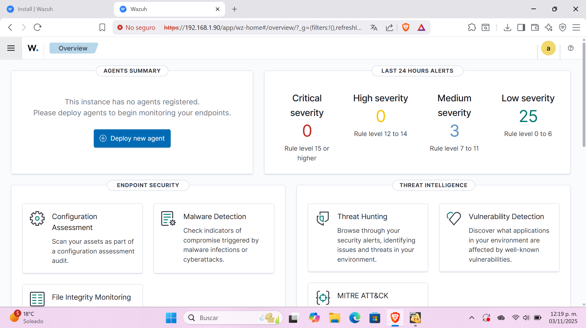
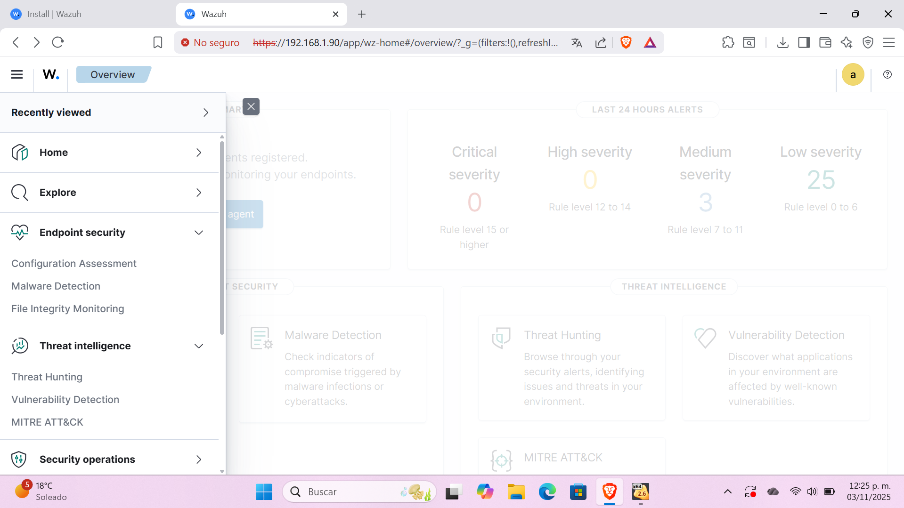
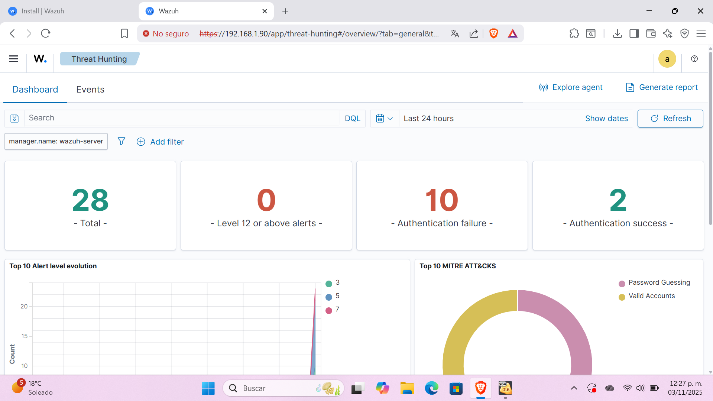
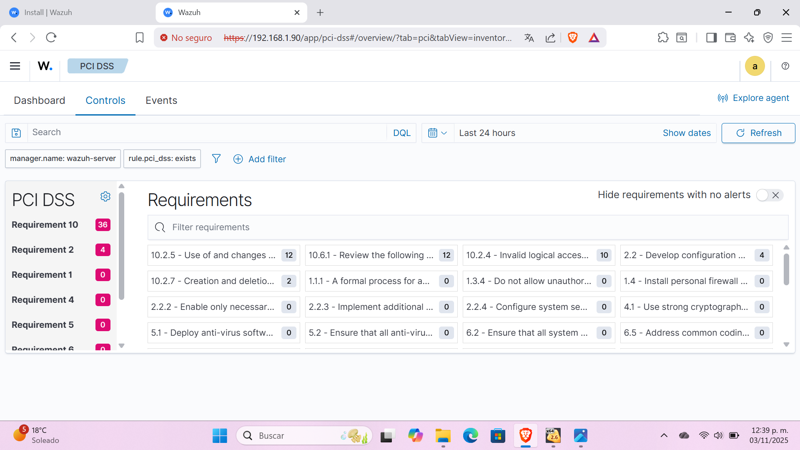

# Wazuh SIEM Introduction

## Objective
To explore and understand the basic operation of a SIEM (Security Information and Event Management) by installing and configuring **Wazuh** in a virtual machine.  
This lab is part of my learning path to become a **SOC Analyst (Blue Team)**.

## Description
During this exercise, I installed **Wazuh version 4.14.0 OVA** in **VirtualBox**, configured system resources, and verified server connectivity.  
The main goal was to get familiar with the core modules of a SIEM: **Dashboard, Security Events, Threat Hunting, PCI DSS, and Agents**.

## Evidence
Below are the most relevant screenshots from the environment:

1. **Login Screen**  
   

2. **Main Dashboard**  
   Displays alert summaries by severity and active modules.  
   

3. **Navigation Menu**  
   Provides access to core sections such as Threat Hunting and Endpoint Security.  
   

4. **Threat Hunting View**  
   Shows detected events, authentication failures, and key metrics.  
   

5. **PCI DSS Dashboard**  
   Visual compliance overview with PCI DSS standards.  
   

6. **PCI DSS Requirements**  
   Detailed list of security controls and alerts associated with each requirement.  
   

## Conclusion
This lab helped me understand the general structure of a SIEM and how it centralizes security data.  
I learned how to interpret dashboards, metrics, and logs that assist in detecting suspicious activities in real time.

**Skills developed:**  
- SIEM installation and configuration  
- Alert and metric analysis  
- Security module exploration  
- Technical documentation

---

Javier A.
02/11/25
ajsentinet
