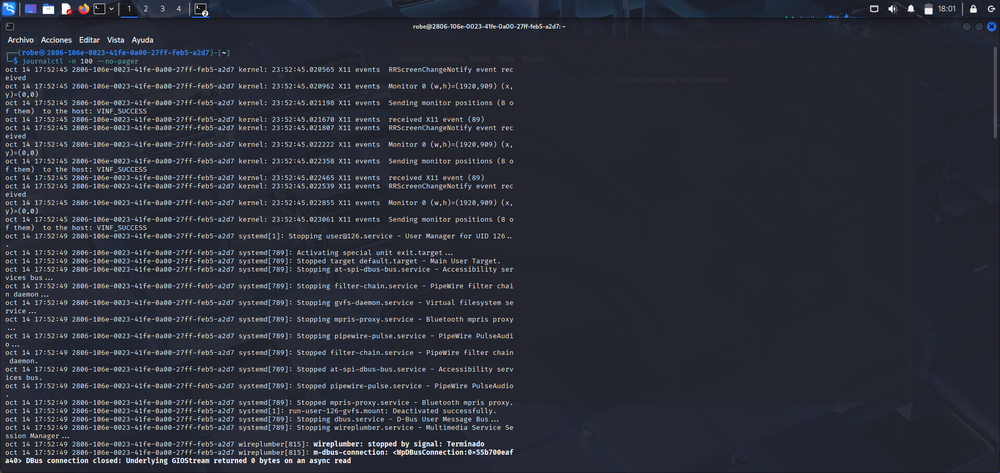
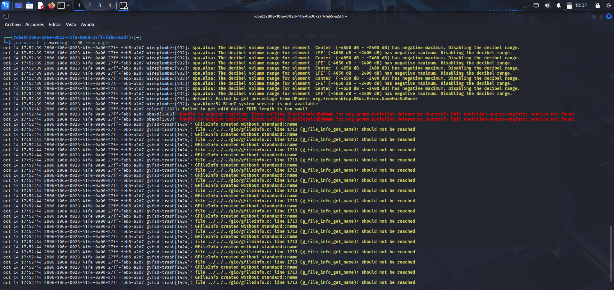
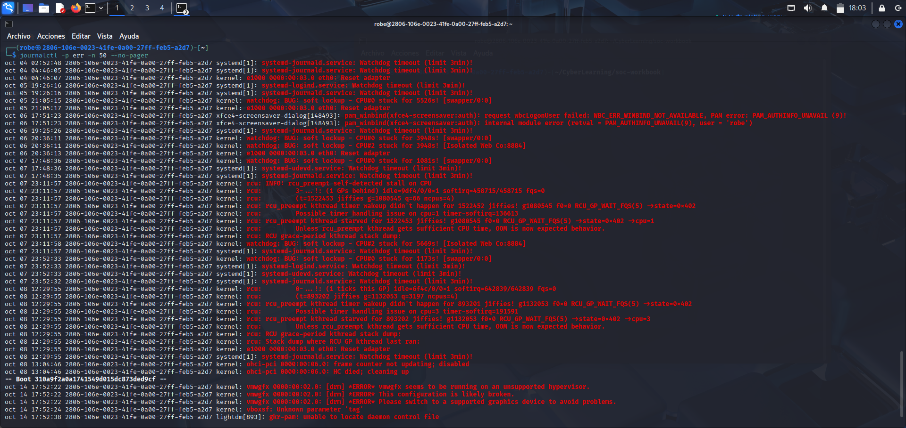
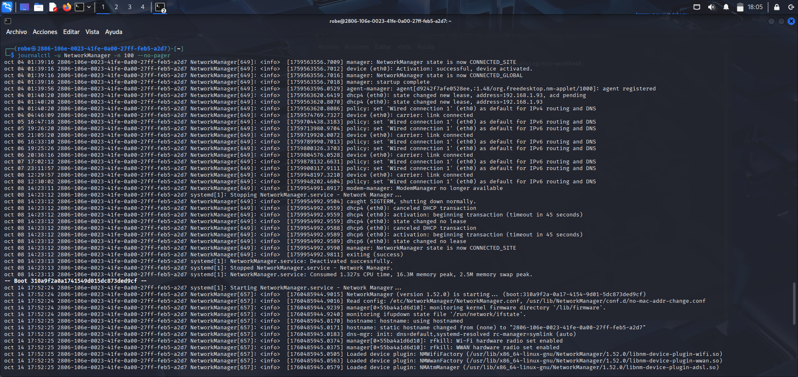
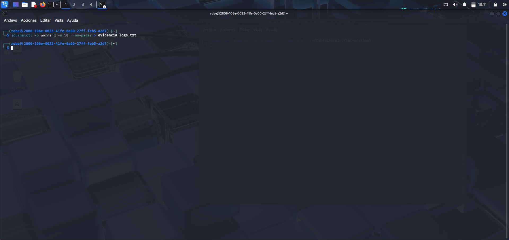

# 🧾 Practice: System Log Analysis (Linux)

## 🎯 Objective
Explore and analyze system logs using `journalctl` in order to identify important events, warnings, and errors that affect the operating system's performance.

---

## ⚙️ Commands used
```bash
journalctl -n 100 --no-pager
journalctl -p warning -n 50 --no-pager
journalctl -p err -n 50 --no-pager
journalctl -u NetworkManager -n 100 --no-pager
journalctl -p warning -n 50 --no-pager > evidencia_logs.txt
```

---

## 🔍 Practice description
During this practice, a detailed analysis of system logs was performed using the `journalctl` tool.  
Logs were filtered by type: **general**, **warning**, **error**, and **NetworkManager events** were also examined.  
The main goal was to understand how different system processes leave traces in log files and how that information can be interpreted for monitoring and troubleshooting.

---

## 🖼️ Evidence

### 1️⃣ General logs
  
Shows the latest events recorded by the system, including kernel processes, `systemd`, and other active services.

### 2️⃣ Warning logs
  
Displays warning messages generated by services like `wireplumber` and `gvfs-trash`, related to audio management and graphical file handling.

### 3️⃣ Error logs
  
Critical kernel errors are identified, generally associated with the virtualization environment and hardware load issues.

### 4️⃣ Network events
  
Shows the connection process managed by `NetworkManager`, including IP assignment and network interface activation.

### 5️⃣ Evidence file
  
Exported log file containing the most recent warning events for later analysis.

---

## ✍️ Conclusion
This practice helped me understand that logs are an essential source of information for system analysis and security.  
Each line in the logs tells part of the technical story of the operating system.  
Learning to read, filter, and classify these events is a key step in developing monitoring and incident-detection skills within a SOC environment.

---

Javier A. 24/10/25

